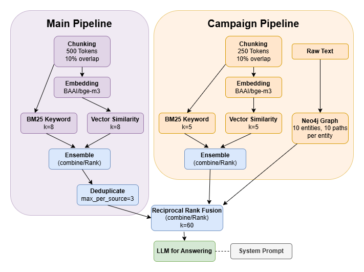

# Petrichor [Game Master Assistant]

---

# Introduction

As a creator, it is common to experience fatigue and burnout, both of which present major challenges when crafting inspirational and innovative materials. This relates directly to Game Masters (GMs) that run Tabletop Role Playing Games (TTRPGs). They run games often, which creates pressure on both time and diversity of material. LLMs have a different creative block, which is homogenous creativity, causing LLMs to be on average less creative than humans; this occurs both across LLMs (different LLM families) and within LLMs (same LLM families), where LLMs will also produce similar output to each other [1,3]. Preliminary evidence shows that even a small amount of new material injected can assist in breaking an LLM out of that cycle [2].

Introducing Petrichor, a new Game Master helper for TTRPGs. Petrichor is a dual-path hybrid retrieval RAG system that works off a diverse corpus, plus your campaign notes, to inject an LLM with diverse creative material for the next plot hook, character, thematic trap, and more. The main Claude version of Petrichor showed an increase in the actionability criterion in both benchmarks where the metric is present; exhibiting a 3.3% (0.82 to 0.86 on a 0–1 scale) absolute increase over the baseline model in domain specific queries/prompts and a 10.7% (0.44 to 0.55 on a 0–1 scale) absolute increase over generic creative prompts. All other metrics experience drops between the RAG version and the baseline version, but actionability is arguably one of the more important and difficult elements to capture in a narrative.

---

# Data Overview

The curated static corpus consists of 32 Project Gutenberg novels, 8 TTRPG rulebooks or handbooks, and 5 TTRPG scenario books. The novels act as a pure and classic form of narrative creativity, while TTRPG related books depict more active and actionable narrative structures. The corpus is comprised of a wide variety of file types (PDF, txt, docx, markdown, etc.), which are either public domain, licensed under Creative Commons, or fall under other permissive licensing. Other than using different packages to pull text for different file types, the files themselves were not altered and all file types were treated as equally as possible.

### Corpus and Campaign Notes Addition

Adding to the corpus is easy with `chunking.ipynb` and `embedding.ipynb` notebooks provided in the repo, as a hashing system is used to add new works or re-embed on alteration or removal. The system can natively handle `.txt`, `.pdf`, `.md`, and `.docx` files. When inserting files, put them in the correct folder and label the file in the form `"authorlastname1-authorlastname2_titlept1_titlept2_titlept3.fileextension"`. Failure to do so may result in an error.

**Only the Gutenberg works are available for download to ensure there are no unintended license breaches.** 

Campaign notes may be optionally supplied to the system, which should ideally be broken up into different parts that are no more than 8–10 pages of length each when inserted for ingestion. Campaign notes stay strictly within the session and are deleted on close-out.

### Data Evaluation Process

Due to the nature of the creative corpus, a standard test split was unsuitable for the task. Instead, three benchmarks were evaluated; two utilized open-ended prompting (one is domain-specific and created by hand and the other is a subset of an existing database of generic creative prompts), while the final benchmark utilized a synthetic dataset created from the corpus to test competence of retrieval. These benchmarks collectively act as a substitute for a "holdout" set. All benchmarks were evaluated by LLM-as-judge and are described in more depth in the **Evaluation** section.

---

# Methodology

Petrichor is a hybrid-retrieval RAG system utilizing vector similarity and BM25 for both the main pipeline and the optional campaign notes pipeline; Neo4j graph retrieval is an addition to the campaign notes pipeline to visualize and assist in keeping track of complex relationships. Chunking was conducted with LangChain recursive text splitter in 500 token chunk increments for the static corpus and 250 chunk increments for the campaign notes, both with a standard 10% token overlap. These chunks were embedded using the multi-purpose embedder `BAAI/bge-m3`. Importantly, to prevent flooding from any one context source, the static corpus main pipeline is deduplicated with a max of three chunks from each source.

### Vector Similarity Search

Vector similarity search works by the mathematical comparison of embedded vectors from the informational chunks with the query projected into the same space. Vector representations of chunks that are the most mathematically similar to the query will surface into the retriever. Vector similarity search is present in both the main pipeline and the campaign notes optional pipeline. Petrichor has a default setting of k=8 retrieved chunks for the main pipeline and k=5 retrieved chunks for the campaign notes pipeline.

### BM25 Keyword Search

BM25 stands for "Best Match 25". The algorithm takes a count of the query terms (term frequency) and puts it against the overall frequency of the terms in the dataset (inverse document frequency), from which it calculates a relevance score. The keyword search works by finding the best matches on exact tokens specifically contained within the query, which makes it a good choice for finding precise words. It is not uncommon to combine this search with vector similarity in hybrid retrieval. BM25 is present in both the main pipeline and the campaign notes optional pipeline. Petrichor has a default setting of k=8 retrieved chunks for the main pipeline and k=5 retrieved chunks for the campaign notes pipeline.

### Neo4j Graph Traversal

Neo4j and other graph-based retrieval are beneficial for queries that require multi-hop logic. GraphRAG represents knowledge based on entities as nodes that are connected by relationships, which are edges. These entities and relationships are tagged by an LLM. A visual panel, initially tested with a Gradio UI, can be powered by PyVis for direct referencing of the nodes and entities within the campaign notes. Neo4j utilizes cloud-based storage called AuraDB for the nodes and edges, which are removed from this storage post session. GraphRAG is only available for the campaign notes portion. The retrieval for the GraphRAG portion is limited to 10 entities and 10 paths for said entities.

### Reciprocal Rank Fusion

Reciprocal rank fusion receives the combined and ranked vector similarity and BM25 list from the corpus side, the combined and ranked vector similarity and BM25 list from the campaign side when applicable, and the GraphRAG entities/relationships when applicable. These three lists are combined and reranked. The dampening constant used is k=60, as selected originally by Cormack, Clarke, and Buettcher, 2009. This result is handed to the answering LLM as context. Importantly, this step only happens if campaign notes are present.


### Methods Diagram


---

# Evaluation

### All Evaluation Criteria

#### Custom Criteria (DeepEval)

*(descriptions based on code)*

- **Actionability:** Whether the TTRPG element gives a GM something immediately usable at the table. High scores mean clear stakes, a defined situation, and enough specificity to avoid major gaps. Low scores mean purely atmospheric with no actionability or development.
- **Narrative Specificity:** Whether the TTRPG element contains specific concrete details for both characters and settings rather than generic archetypes and vague locations. High scores mean memorable and distinct details throughout. Low scores mean generic stereotypes and placeholder descriptions.
- **Tonal Coherence:** Whether the TTRPG element maintains a consistent genre register throughout. High scores mean the tone is unified and purposeful from start to finish. Low scores mean the tone shifts jarringly between genres or registers.
- **Decisiveness:** Whether the TTRPG element confidently adheres to a single narrative direction. High scores mean fully committed with no hedging, and any additional pathways contribute directly to the whole. Low scores mean multiple non-interconnected directions are offered or the element is unresolved.

#### Built-in Criteria

*(RAG Triad based, DeepEval and RAGAS)*

- **Answer Relevancy (DeepEval only):** A measure of how well the response addresses the input query.
- **Answer Correctness (RAGAS only):** A measure of how well the generated response answers the reference/ground-truth answer.
- **Faithfulness:** A measure of how well the response is supported by the retrieved context.
- **Context Relevance / Contextual Relevancy:** A measure of how relevant the retrieved chunks were to the input query, regardless of how they are used in the response. RAGAS and DeepEval have different measurements of this.

### Benchmark 1: TTRPG Handwritten Set [DeepEval]

Benchmark 1 consists of 41 handwritten TTRPG specific open-ended queries. The LLM judge was GPT-5.4, and the evaluation framework used was DeepEval. The results are on a 0–1 point scale with the criteria pass rate percentages below. This benchmark was created as a domain-specific, purpose-built evaluation of handling direct TTRPG creative generation requests. The pass threshold per query is 0.5 for all criteria.

| Model | Answer Relevancy | Actionability | Narrative Specificity | Tonal Coherence | Decisiveness | Faithfulness | Contextual Relevancy |
|---|---|---|---|---|---|---|---|
| Claude (baseline) | 0.99 (100%) | 0.82 (87.8%) | 0.93 (100%) | 0.94 (100%) | 0.94 (100%) | — | — |
| **Petrichor (Claude + RAG)** | 0.97 (100%) | 0.86 (95%) | 0.87 (100%) | 0.85 (100%) | 0.87 (100%) | 0.98 (100%) | 0.22 (0%) |
| GPT-4.1 (baseline) * | 1.00 (100%) | 0.70 (87.8%) | 0.87 (100%) | 0.97 (100%) | 0.93 (97.56%) | — | — |
| Gemini 3.1 Pro (baseline) | 0.99 (100%) | 0.79 (87.5%) | 0.92 (97.5%) | 0.92 (97.5%) | 0.93 (97.5%) | — | — |
| Gemma 4 12B (baseline) | 0.96 (100%) | 0.81 (92.68%) | 0.89 (100%) | 0.87 (100%) | 0.89 (100%) | — | — |
| **Gemma 4 12B + RAG** | 0.92 (100%) | 0.73 (90.2%) | 0.75 (95.1%) | 0.71 (85.4%) | 0.81 (100%) | 0.93 (100%) | 0.21 (2.4%) |

\* May be subject to self-bias as GPT-5.4 is judging GPT-4.1.

### Benchmark 2: euclaise/writingprompts Subset [DeepEval]

Benchmark 2 consists of 40 (run and trimmed down from 44 to account for AI response refusals) randomly selected and human approved general writing prompts from euclaise/writingprompts. The LLM judge was GPT-5.4, and the evaluation framework used was DeepEval. The results are on a 0–1 point scale with the criteria pass rate percentages below. This benchmark was selected as a generic creative writing counterpart to the domain-specific Benchmark 1 to test how models perform with broader, less specific prompts. The pass threshold per query is 0.5 for all criteria.

| Model | Answer Relevancy | Actionability | Narrative Specificity | Tonal Coherence | Decisiveness | Faithfulness | Contextual Relevancy |
|---|---|---|---|---|---|---|---|
| Claude, no RAG (base) | 1.00 (100%) | 0.44 (40%) | 0.87 (100%) | 0.94 (100%) | 0.92 (100%) | — | — |
| **Petrichor (Claude + RAG)** | 0.93 (100%) | 0.55 (52.5%) | 0.72 (87.5%) | 0.83 (100%) | 0.85 (100%) | 0.98 (100%) | 0.18 (2.5%) |
| GPT-4.1 (baseline) * | 0.99 (100%) | 0.26 (5%) | 0.81 (97.5%) | 0.93 (100%) | 0.93 (100%) | — | — |
| Gemini 3.1 Pro (baseline) | 0.99 (100%) | 0.50 (50%) | 0.91 (100%) | 0.94 (100%) | 0.94 (100%) | — | — |

\* May be subject to self-bias as GPT-5.4 is judging GPT-4.1.

### Benchmark 3: Synthetic RAGAS on Corpus [RAGAS]

Benchmark 3 consists of 40 synthetic queries/prompts generated by RAGAS from the static corpus data. The LLM judge was GPT-4.1, and the evaluation framework used was RAGAS. The results are on a 0–1 point scale. This benchmark exists primarily to test the retrieval capabilities of the RAG system and secondarily to test the answering capabilities of the baseline models.

| Model | Answer Correctness | Faithfulness | Context Relevance |
|---|---|---|---|
| Claude, no RAG (base) | 0.38 | — | — |
| **Petrichor (Claude + RAG)** | 0.50 | 0.79 | 0.81 |
| GPT-4.1 (baseline) * | 0.46 | — | — |
| Gemini 3.1 Pro (baseline) | 0.42 | — | — |

\* Likely subject to self-bias as GPT-4.1 is judging GPT-4.1.

### Model Selection/Results

Claude was selected early in the process due to familiarity, capability, ease of use, and the fact that creativity can be a difficult task overall for LLMs. The comparison models, GPT-4.1 and Gemini 3.1 Pro, were selected because they are frontier level models that are likely of a similar size to Claude. Gemma 4 12B Q8_0 was also tested on Benchmark 1 as an open-weights option to the system due to its native creativity and strong instruction following capabilities.

The most difficult non-RAG specific metric for the LLMs across the board was actionability, which is the task that Claude version Petrichor excelled at over all other models for both benchmarks. This includes a 3.3% (0.82 to 0.86 on a 0–1 scale) absolute increase over the baseline model in domain specific queries/prompts and a 10.7% (0.44 to 0.55 on a 0–1 scale) absolute increase over generic creative prompts. While Claude version Petrichor fell to the lower-middle of the pack in Benchmark 1 outside of the actionability criterion, the scores for Petrichor suffered relative to other models in Benchmark 2; despite this, Petrichor still maintained a 100% pass rate outside of narrative specificity at 0.72 points (87.5% pass rate), contextual relevancy, and actionability, the latter two of which no model scored at 100%. Contextual relevancy was failed across all benchmarks aside from Benchmark 3 due to a lack of a "correct answer," but faithfulness was strong across all benchmarks (lowest at 0.79 points), and contextual relevancy increased to 0.81 points in the presence of questions with "ground-truths." Petrichor also answers correctly on more statements than the baseline models. The Gemma version of Petrichor struggles compared to the Claude version Petrichor and baseline version Gemma, which was qualitatively assessed to find that the model was less capable of sophisticatedly integrating the retrieved information than Claude.

---

# Usage and Intended Uses

The intended usage of this RAG system is to create plot hooks, characters, thematic traps, and more. None of the tested models are loadable via HuggingFace and most are instead called by API. An exception to the API calls is that Gemma 4 12B Q8_0 can be used with a `llama-cpp` wheel. The main path can be run locally or through an app, but the campaign notes portion was designed to have a UI. Campaign notes can enrich responses by adding personalization through the bespoke content of an individual's created settings, characters, and factions. This allows one to ask for hooks, characters, traps, and other elements set within their own world.

### Main Pipeline (Utilizing Claude)

```python
import os
import json
from dotenv import load_dotenv

import torch
from langchain_chroma import Chroma
from langchain_core.documents import Document
from langchain_huggingface import HuggingFaceEmbeddings
from langchain_community.retrievers import BM25Retriever
from langchain_classic.retrievers import EnsembleRetriever

from anthropic import Anthropic

# Environment
load_dotenv()
client = Anthropic()
system_prompt = (
    " You are a creative Game Master assistant. You will be provided with a corpus of novels "
    "and TTRPG books to draw from. You must primarily use these sources to satisfy the query "
    "parameters. You may also be given Campaign Notes and Campaign Graph context describing "
    "THIS user's own ongoing game. Treat established campaign facts (who exists, what has "
    "happened, how things relate) as fixed continuity, not something to reinvent or "
    "contradict, but the same as with the corpus, draw on these facts freely as creative "
    "inspiration when generating new plot hooks, characters, or scenes. If asked directly "
    "about the campaign and the answer isn't present in what's provided, say so plainly "
    "rather than inventing it. You may supplement with your own knowledge, but you must "
    "consult the corpus for relevant information first. Always cite corpus sources. Corpus "
    "sources are cited in the form: title, author [type], or entity [type]. You may deviate "
    "from this citation format for direct quotations or in text body citations, but the "
    "sources must still be cited. Cite campaign notes by session and file (e.g., Session 3, "
    "session3_notes.txt). Cite campaign graph entities by name (e.g., Cassius). Do not offer "
    "multiple narrative options. Confidently offer a diversely inspired narrative response. "
    "Avoid creating tables unless needed for stat blocks when asked to produce a character. "
)

# Embedder and persistent corpus store
embedder = HuggingFaceEmbeddings(
    model_name="BAAI/bge-m3",
    model_kwargs={"device": "cuda" if torch.cuda.is_available() else "cpu"},
    encode_kwargs={"normalize_embeddings": True}
)

corpus_store = Chroma(
    persist_directory="./chroma_db",
    collection_name="TTRPG_corpus",
    embedding_function=embedder
)

# BM25 and vector hybrid retrieval
with open("corpus_chunks.json", "r", encoding="utf-8") as f:
    unembed_chunks = json.load(f)

corpus_docs = [
    Document(page_content=chunk["text"], metadata=chunk["metadata"])
    for chunk in unembed_chunks
]

bm25_retriever = BM25Retriever.from_documents(corpus_docs, k=8)
vector_retriever = corpus_store.as_retriever(search_kwargs={"k": 8})
corpus_retriever = EnsembleRetriever(
    retrievers=[bm25_retriever, vector_retriever], weights=[0.5, 0.5]
)

# Deduplication to avoid context flooding. Max chunks set to 3 by default.
def deduplicate_by_source(docs, max_per_source=3):
    seen = {}
    result = []
    for doc in docs:
        source = doc.metadata.get("source")
        seen[source] = seen.get(source, 0)
        if seen[source] < max_per_source:
            result.append(doc)
            seen[source] += 1
    return result

# Formatting the context. Add metadata.
def format_context(docs):
    chunks = []
    for doc in docs:
        meta = doc.metadata
        label = (
            f"[{meta.get('title','unknown')}] by "
            f"{meta.get('author','unknown')} [{meta.get('type','unknown')}]"
        )
        chunks.append(f"{label}\n{doc.page_content}")
    return "\n\n".join(chunks)

# Retrieve the context and generate the response to the query.
def generate(query, system_prompt):
    docs = deduplicate_by_source(corpus_retriever.invoke(query))
    context = format_context(docs)
    response = client.messages.create(
        model="claude-sonnet-4-6",
        max_tokens=2000,
        system=system_prompt,
        messages=[{"role": "user", "content": f"Context:\n{context}\n\nQuery: {query}"}]
    )
    return response.content[0].text

# Example
query = "Write me a plot hook about a player party of jovial misfits at sea who wash up on the sandy beaches of a mystical island that is not what it seems."
print(generate(query, system_prompt))
```

### Campaign Notes Pipeline (Claude and Neo4j)

> Intended to be used with a UI.

```python
import re
from pathlib import Path
from collections import defaultdict

import chromadb
from neo4j import GraphDatabase
from transformers import AutoTokenizer
from langchain_text_splitters import RecursiveCharacterTextSplitter

import pdfplumber
from docx import Document as DocDoc

# Neo4j connection
NEO4J_URI = os.getenv("NEO4J_URI")
NEO4J_USERNAME = os.getenv("NEO4J_USERNAME")
NEO4J_PASSWORD = os.getenv("NEO4J_PASSWORD")

neo4j_driver = GraphDatabase.driver(NEO4J_URI, auth=(NEO4J_USERNAME, NEO4J_PASSWORD))

# Session-scoped campaign vector store (reuses the same embedder from main path)
campaign_store = Chroma(
    client=chromadb.Client(),
    collection_name="campaign_notes",
    embedding_function=embedder
)

campaign_docs_session = defaultdict(list)
campaign_retrievers = {}
processed_filenames = defaultdict(set)

def build_campaign_retriever(session_id):
    campaign_docs = campaign_docs_session[session_id]
    if not campaign_docs:
        campaign_retrievers.pop(session_id, None)
        return
    bm25_campaign = BM25Retriever.from_documents(campaign_docs, k=5)
    vector_campaign = campaign_store.as_retriever(
        search_kwargs={"k": 5, "filter": {"session_id": session_id}}
    )
    campaign_retrievers[session_id] = EnsembleRetriever(
        retrievers=[bm25_campaign, vector_campaign], weights=[0.5, 0.5]
    )

#  Reciprocal Rank Fusion (merging corpus and campaign and graph results)
def _rrf(ranked_lists, k=60):
    scores = defaultdict(float)
    for rank in ranked_lists:
        for r, doc_id in enumerate(rank, start=1):
            scores[doc_id] += 1.0 / (k + r)
    return sorted(scores, key=lambda x: scores[x], reverse=True)

#  Entity extraction (Claude Haiku) for graph queries
def parse_json_response(raw_text):
    text = raw_text.strip()
    text = re.sub(r"^```\s*(?:json)?\s*", "", text)
    text = re.sub(r"\s*```$", "", text)
    return json.loads(text.strip())

def extract_entities(text):
    response = client.messages.create(
        model="claude-haiku-4-5",
        max_tokens=500,
        messages=[{"role": "user", "content": f'''Extract all named entities (characters,
        locations, factions, items, events, monsters, spells, etc.) from the text.
        Only return a JSON array of the entity names, nothing additional.
        Text: {text}'''}]
    )
    return parse_json_response(response.content[0].text)

#  Graph traversal, capped at 10 entities / 10 paths per entity
def graph_retrieve(query, session_id, campaign_results=None, max_hops=3):
    if not campaign_docs_session[session_id]:
        return []
    entities = extract_entities(query)
    if not entities and campaign_results:
        seed_text = " ".join(doc.page_content for doc in campaign_results[:3])
        entities = extract_entities(seed_text)
    if not entities:
        return []

    with neo4j_driver.session() as neo4j_session:
        result = neo4j_session.run(
            f'''
            MATCH (e:Entity {{session_id: $session_id}})
            WHERE any(name IN $entities WHERE tolower(e.name) CONTAINS toLower(name))
            OPTIONAL MATCH path = (e)-[rels*1..{max_hops}]-(neighbor:Entity {{session_id: $session_id}})
            WHERE neighbor IS NULL OR neighbor <> e
            WITH e, collect(DISTINCT CASE WHEN path IS NULL THEN NULL ELSE {{
                   nodes: [n IN nodes(path) | n.name],
                   rels: [r IN relationships(path) | r.relation]
                   }} END) AS all_paths
            RETURN e.name AS name, e.type AS type, e.description AS description,
                   all_paths[0..10] AS paths
            ORDER BY size(all_paths) DESC
            LIMIT 10
            ''',
            entities=entities, session_id=session_id
        )
        docs = []
        for record in result:
            content = f"{record['name']} ({record['type']})\n{record['description']}"
            chains = []
            for p in record['paths']:
                if not p or not p.get('nodes'):
                    continue
                nodes, rels = p['nodes'], p['rels']
                chain = nodes[0]
                for rel, nxt in zip(rels, nodes[1:]):
                    chain += f" --[{rel}]--> {nxt}"
                if len(nodes) > 1:
                    chains.append(chain)
            if chains:
                content += "\nConnections:\n" + "\n".join(f"- {c}" for c in chains)
            docs.append(Document(
                page_content=content,
                metadata={"source": record['name'], "type": "campaign_graph", "session_id": session_id}
            ))
    return docs

# Full retrieval: merges corpus, campaign notes, and graph results via RRF above.
def retrieve(query, session_id):
    corpus_results = deduplicate_by_source(corpus_retriever.invoke(query))
    campaign_ret = campaign_retrievers.get(session_id)
    campaign_results = campaign_ret.invoke(query) if campaign_ret else []
    graph_results = graph_retrieve(query, session_id, campaign_results=campaign_results)

    if not campaign_results and not graph_results:
        return corpus_results

    doc_map = {}
    all_lists = []
    for results in [campaign_results, graph_results, corpus_results]:
        if results:
            ids = [id(doc) for doc in results]
            for i, doc in zip(ids, results):
                doc_map[i] = doc
            all_lists.append(ids)

    merged_res = _rrf(all_lists)
    return [doc_map[i] for i in merged_res if i in doc_map]

# Campaign note ingestion support: extract text, tag metadata, write graph.

# Extract raw text from uploaded file of a variety of file type extensions.
def extract_text(file):
    ext = Path(file.name).suffix.lower()
    if ext in (".txt", ".md"):
        with open(file.name, "r", encoding="utf-8") as f:
            return f.read()
    elif ext == ".pdf":
        text = ""
        with pdfplumber.open(file.name) as pdf:
            for page in pdf.pages:
                page_text = page.extract_text()
                if page_text:
                    text += page_text
        return text
    elif ext in (".docx", ".doc"):
        doc = DocDoc(file.name)
        return "\n".join(p.text for p in doc.paragraphs if p.text.strip())
    return ""

# Extracts entities, relationships and tags from campaign utilizing Claude Haiku.
def extract_campaign_meta(txt):
    response = client.messages.create(
        model="claude-haiku-4-5", max_tokens=8000,
        messages=[{"role": "user", "content": f'''Analyze the TTRPG campaign notes and return
        only a JSON object containing: "tags" (list of named entities), "entities" (list of
        objects with "name", "type", "description"), "relationships" (list of objects with
        "source", "target", "relation"). Text: {txt}'''}]
    )
    if response.stop_reason == "max_tokens":
        raise ValueError("Max tokens exceeded. Add tokens or put in smaller chunks of text")
    return parse_json_response(response.content[0].text)

# Writing the extracted entities and relationships to Neo4j graph.
def writing_graph_entities(entities, relationships, session_id):
    with neo4j_driver.session() as neo4j_session:
        for entity in entities:
            neo4j_session.run('''
            MERGE (e:Entity {name: $name, session_id: $session_id})
            SET e.type = $type, e.description = $description
            ''', name=entity['name'], session_id=session_id,
                 type=entity.get("type", "unknown"), description=entity.get("description", ""))
        for rel in relationships:
            neo4j_session.run('''
            MATCH (a:Entity {name: $source, session_id: $session_id})
            MATCH (b:Entity {name: $target, session_id: $session_id})
            MERGE (a)-[r:RELATED_TO {session_id: $session_id}]->(b)
            SET r.relation = $relation
            ''', source=rel['source'], target=rel['target'], session_id=session_id,
                 relation=rel.get("relation", "related_to"))

campaign_tokenizer = AutoTokenizer.from_pretrained("BAAI/bge-m3")
campaign_splitter = RecursiveCharacterTextSplitter.from_huggingface_tokenizer(
    campaign_tokenizer, chunk_size=250, chunk_overlap=25
)

# Takes in and processes the campaign notes.
def ingest_campaign_notes(files, session_number, session_id):
    if not files:
        return "No campaign notes provided."
    processed, skipped = 0, 0
    for file_idx, file in enumerate(files):
        filename = Path(file.name).name
        if filename in processed_filenames[session_id]:
            skipped += 1
            continue
        processed_filenames[session_id].add(filename)

        text = extract_text(file)
        if not text.strip():
            continue

        meta = extract_campaign_meta(text)
        writing_graph_entities(meta["entities"], meta["relationships"], session_id)

        chunks = campaign_splitter.create_documents([text])
        total = len(chunks)
        docs = []
        for i, chunk in enumerate(chunks):
            chunk.metadata.update({
                "session_id": session_id,
                "session": int(session_number) if session_number is not None else file_idx,
                "source": filename,
                "chunk_index": i,
                "temporal_position": i / total,
                "tags": ", ".join(meta["tags"])
            })
            docs.append(chunk)

        campaign_store.add_documents(docs)
        campaign_docs_session[session_id].extend(docs)
        processed += 1

    build_campaign_retriever(session_id)
    msg = f"Ingested {processed} campaign note(s)."
    if skipped:
        msg += f" Skipped {skipped} file(s) with a name already used this session."
    return msg

#  Sessions are not persistent. Clean up the Neo4j.
def clear_session(session_id):
    if not isinstance(session_id, str):
        return
    with neo4j_driver.session() as neo4j_session:
        neo4j_session.run("MATCH (e:Entity {session_id: $session_id}) DETACH DELETE e", session_id=session_id)
    results = campaign_store.get(where={"session_id": session_id})
    if results["ids"]:
        campaign_store.delete(ids=results["ids"])
    campaign_docs_session.pop(session_id, None)
    campaign_retrievers.pop(session_id, None)
    processed_filenames.pop(session_id, None)
```

---

# Prompt Format

The system prompt is made using Direct Instruction Prompting. It is passed through `system`, which instructs the LLM to have a persona, properly construct citations, avoid offering multiple narrative options, treat campaign notes as fact, and avoid creating unnecessary tables. This is combined with the user message, which is context chunks from RAG, and the query itself.

```python
system_prompt = (
    " You are a creative Game Master assistant. You will be provided with a corpus of novels "
    "and TTRPG books to draw from. You must primarily use these sources to satisfy the query "
    "parameters. You may also be given Campaign Notes and Campaign Graph context describing "
    "THIS user's own ongoing game. Treat established campaign facts (who exists, what has "
    "happened, how things relate) as fixed continuity, not something to reinvent or "
    "contradict, but the same as with the corpus, draw on these facts freely as creative "
    "inspiration when generating new plot hooks, characters, or scenes. If asked directly "
    "about the campaign and the answer isn't present in what's provided, say so plainly "
    "rather than inventing it. You may supplement with your own knowledge, but you must "
    "consult the corpus for relevant information first. Always cite corpus sources. Corpus "
    "sources are cited in the form: title, author [type], or entity [type]. You may deviate "
    "from this citation format for direct quotations or in text body citations, but the "
    "sources must still be cited. Cite campaign notes by session and file (e.g., Session 3, "
    "session3_notes.txt). Cite campaign graph entities by name (e.g., Cassius). Do not offer "
    "multiple narrative options. Confidently offer a diversly inspired narrative response. "
    "Avoid creating tables unless needed for stat blocks when asked to produce a character. "
)

query = "Write me a plot hook about a player party of jovial misfits at sea who wash up on the sandy beaches of a mystical island that is not what it seems."

# Portion of def_generate. See Main Pipeline under Usage for dedup function.
docs = deduplicate_by_source(corpus_retriever.invoke(query))
context = format_context(docs)

messages = [
    {
        "role": "user",
        "content": f"Context:\n{context}\n\nQuery: {query}"
    }
]
```

So the format would be:

**system_prompt:**
```
You are a creative Game Master assistant. You will be provided with a corpus of novels
and TTRPG books to draw from... [full system prompt shown above]
```

**user:**
```
Context:
[Title] by [Author] [type]
[retrieved passage text]

[Title] by [Author] [type]
[retrieved passage text]

query: Write me a plot hook about a player party of jovial misfits at sea who wash up
on the sandy beaches of a mystical island that is not what it seems.
```

# Expected Output Format

The output is generated with Claude Sonnet 4.6 and a setting of 2000 max tokens, with a typical output range of ~700–1300 token responses in preliminary tests. The output includes content related to the specific element chosen (character, hook, etc.), but hooks such as this one specifically contain exposition, player engagement, and source/inspirational citation.

```python
# Portion of def_generate. See "Prompt Format" for "messages".
response = client.messages.create(
    model="claude-sonnet-4-6",
    max_tokens=2000,
    system=system_prompt,
    messages=messages
)
```

**Real output example:**

> **The Isle That Breathes**
>
> The party's vessel — a hired tub so disreputable it makes The Pride of the Thames look seaworthy — finally gives up the ghost three days from any port worth naming. A sudden squall does what years of rot and poor seamanship had merely threatened, and the misfits find themselves paddling toward a low green shape on the horizon, laughing because there is nothing else sensible to do.
>
> The island greets them warmly enough. White sand, warm breeze, the smell of coconut and brine. Someone immediately tries to light a cooking fire.
>
> That is when they notice the ground moves.
>
> Not with earthquake violence, but with the slow, breathing patience of something vast and alive — the whole island rising and falling in long, rolling swells as the ocean passes beneath it, because the island is not earth at all. It is a thin, impossibly strong membrane stretched across the water, elastic as a drumskin, and it responds to every wave. Walking toward the treeline is like crossing the deck of a ship in moderate chop. Walking toward the centre, where a hexagonal arrangement of standing stones rises from the surface, is like walking into the belly of a very calm, very ancient creature.
>
> The standing stones are not decorative. Each marks a corner of the hexagonal island, and each one hums faintly to the touch — these are the anchoring points of a prison, laid by people whose name no living scholar agrees upon. The thing they imprisoned is still here, in the middle, and it has been here long enough to nearly remember how to leave.
>
> She calls herself the Daughter of the Elements, and from beneath the central stones she speaks in a voice like a storm deciding whether to bother. She is not yet free. She is, however, working on it.
>
> The party quickly learns two things. First, that at each of the six corner-stones, the Elder Peoples left a weapon capable of completing the imprisonment — tools of binding, each one keyed to a different elemental principle. Second, that mechanical sentinels stalk the membrane-surface between them: ancient automata running on steam engines that tick and hiss in their chests, durable as millstones and about as fast, sent by someone — or something — that does not want those weapons retrieved.
>
> The catch, and there is always a catch aboard vessels this unlucky, is that the storm gathering overhead is her storm, and it is tightening. There is time to reach perhaps two of the six weapon-stones before the weather makes movement impossible and she finishes what she started.
>
> The party must decide quickly: split up across a heaving, wave-rippled floor of impossible material, each group chasing a different corner of a hexagonal prison-island while fighting steel men with boiler hearts — or stay together, get two weapons, and hope that two is enough to hold a sorceress who has had centuries to plan her exit.
>
> The ground rolls under their feet like the back of something sleeping.
>
> It has not always been sleeping.
>
> **Sources:** *One Page Dungeon Contest 2025 Compendium* [scenario] — the hexagonal membrane island, the Daughter of the Elements, the Mechanical Remnants, and the six corner-weapons; *Three Men In A Boat*, Jerome [novel] — the disreputable hired vessel and the tone of jovial maritime misfortune; *The Arabian Nights Entertainment*, Anonymous [novel] — the island that is not what it seems beneath one's feet.

---

# Limitations

### Cost

The base model Claude operates by paid API. Due to costly LLM-as-Judge benchmarking for custom criteria (~$15–17 for baseline/RAG conditions), a formal ablation was not performed for retrieval mechanisms.

### Performance

Preliminary tests have been conducted, including benchmarking; however, extensive qualitative testing has not been performed. Benchmarked figures indicate weakened performance in many categories when the RAG is introduced, suggesting more testing, investigation, and development is required. The smaller tested open-weights model (Gemma 4 12B Q8_0) had difficulties performing citations and quotes without breaking tone and narrative consistency. An architectural performance limitation is that Reciprocal Rank Fusion would likely operate more effectively utilizing a more sophisticated weighting system as opposed to relying on the order in which a chunk is inserted to break ties.

### Complexity of Use

Petrichor requires additional setup for the primary version, including acquisition of an API key, usage of a .env file, and creation of a Neo4j account. The Neo4j instance will need to be reactivated after 72 hours of inactivity.

### Scope

This is a class project and version 1 of this system; therefore, there may be existing bugs or unknown issues. While the campaign notes pipeline allows for multiple users to access and independently use a hosted demo at the same time due to session IDs, the notes are strictly transient and will be wiped after each session at this time to avoid overloading the free tier cloud storage.

---

# Citations

### Introduction

1. Emily Wenger, Yoed N Kenett, Large language models are homogeneously creative, *PNAS Nexus*, Volume 5, Issue 3, March 2026, pgag042, https://doi.org/10.1093/pnasnexus/pgag042
2. Ghods, K., Liu, P., Labrou, K., MacDonald, K., Menon, A., & Wu, A. (n.d.). Evidence against LLM homogenization in creative writing. Retrieved from https://kiaghods.com/assets/pdfs/LLMHomogenization.pdf
3. W. Xu, N. Jojic, S. Rao, C. Brockett, & B. Dolan, Echoes in AI: Quantifying lack of plot diversity in LLM outputs, *Proc. Natl. Acad. Sci. U.S.A.* 122 (35) e2504966122, https://doi.org/10.1073/pnas.2504966122 (2025).

### Methodology Section

1. Aquino, S. (2024, March 19). *Understanding retrieval-augmented generation (RAG) - qdrant*. Qdrant. https://qdrant.tech/articles/what-is-rag-in-ai/
2. Cormack, G. V., Clarke, C. L., & Buettcher, S. (2009, July). Reciprocal rank fusion outperforms condorcet and individual rank learning methods. In *Proceedings of the 32nd international ACM SIGIR conference on Research and development in information retrieval* (pp. 758–759).
3. Hunger, M. (2026, March 24). *What is graphrag?*. neo4j. https://neo4j.com/blog/genai/what-is-graphrag/
4. Weaviate. (n.d.). *Keyword Search (BM25)*. https://docs.weaviate.io/weaviate/concepts/search/keyword-search
